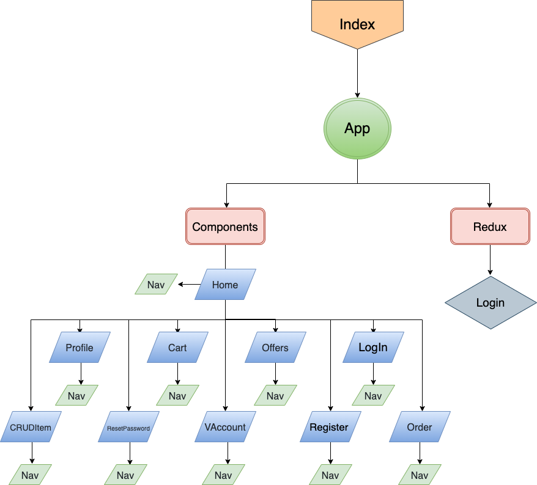

# User Story
- **Visitor:**

  the visitor can browse between alot of delivery company and their restaurant **but** he can't order unless he register or login. 

- **SignUp:**
1. Single User : The user can Register to my website ,so that he can start order,user able to serach between alot of restaurant and see their offer. 
2. Restaurant : The Restaurant can Register to my website ,so that he can start Adding, Updating and Delete item in his restaurant menu.

- **LogIn:**
1. Login User : if user already signup he can login directly to make his order,user able to serach between alot of restaurant and see their offer.

2. Login Restaurant : if user already signup he can login directly to do CRUD for his menu

- **LogOut:**
  A user or restaurant con logout from the website by click logout Button

- **Company Category:**
1. Jahez
2. Hunger Station
3. To You

- **Resturant:**
for each company it has own Restaurants.

- **Resturant Menu:**
Each restaurant has own category.

# Router Routes

| Path | Component | Public Or Private  | Behavior | Permissions | 
| ---         |     ---      |          --- |          --- |          --- |
| `/`   | Hoem     | Public    | Home page, Contant all Restaurant   | User , Admin, Company
| `/login`     | Login       |Public     | Register & login Page    | User , Admin, Company
| `/signUp`    | Register       |Public     | Register & login Page    |User , Admin, Company
| `/offers`     | Offers       |Public     | offers Page    | User , Admin, Company
| `/vAccount/id`     | VAccount       |Private     | Verify Account Page    | User , Admin, Company
| `/resetpass`     | ResetPassword       |Private     | Reset Password  Page.    |User , Company
| `/cart`     | Cart       |Private     | Your cart  Page    |User
| `/order`     | Order       |Private     | after you proccess your order and confirme it page    | User
| `/Profile`     | Profile       |Private     | Profile Page, that contant personal information    | User , Admin, Company
| `/additem`     | CRUDItem       |Private, only Company     | CRUD Item Page, that company can add item to there Restaurant, and you can delete that Item    |Company
| `/edititem`     | CRUDItem       |Private, only Company     | CRUD Item Page, that company can edit item to there Restaurant    | Company

# Components
- Login.
- Register
- Offers
- VAccount
- ResetPassword
- Cart
- Order
- Profile
- CRUDItem

# UML-Digram

# Upload our Work on github:

| Command | Description |
| --- | --- |
| git add . | add our work  |
| git commit | add comment before upload it staged 
| git push | Upload it to your github Repo

# WireFrame
### Main Page

### When Click on **Show offers**

### Chose the Restaurant

### Your Cart

# Links:

1. Link to Trello board => https://trello.com/b/0o0jzsX9/mp-project-eyad

2. My github Page => https://github.com/Eyad911

3. Link to my presentation=> https://eyad.com